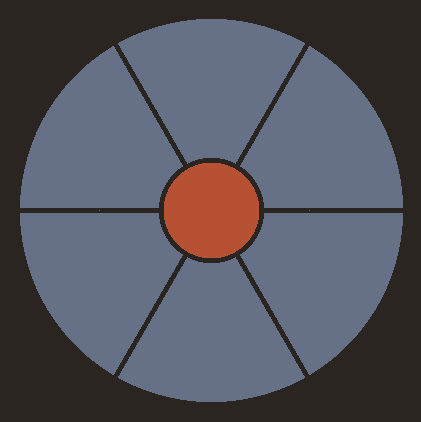

# Selgl - A circular selector written in C using OpenGL

A selector for use with drawing tablets. Spawns a window at current cursor position.
Selection is done by moving the Pen and clicking on one of the segments. Outputs a number
corresponding to the segment.

<p align="center">

</p>

Intended use is with a script that captures the selection output and performs some kind
of action, depending on the output.

## Roadmap:
- [ ] fix bug where window closes before action
- [ ] improve CLI
  - [ ] proper argument parsing
  - [ ] use flags for arguments
  - [ ] custom colors as arguments
- [ ] rotate segments for better visuals and symmetry
- [ ] custom icons

## Building
Just run make in the root directory.

```shell
$ git clone https://github.com/brudihawo/selgl
$ cd selgl
$ make
$ ./selgl
```

## Use

```shell
$ ./selgl [windowsize] [n_segments]
```

Note: Curently, arguments are not independent of each other. This will be fixed in a
future commit. First argument needs to be window size, second one is number of
segments.They can be omitted, but the arguments will be interpreted in that order.

